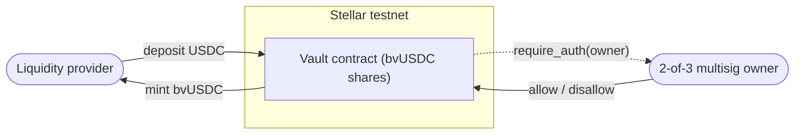

# Ballast Vault (mini)

[](./LICENSE)
[](https://developers.stellar.org)
[](https://stellar.org/soroban)

A minimal reinsurance-style yield vault on **Stellar / Soroban**. Liquidity providers deposit USDC and receive `bvUSDC` shares that track the vault's net asset value, redeemable for USDC on-chain. Built on the OpenZeppelin Soroban vault, with a React + Freighter dApp and a multisig-governed KYC allowlist.

> [!NOTE]
> Learning-grade proof of concept ("mini-Ballast") running on Stellar **testnet**. Shares stay 1:1 with the underlying (no yield accrual) and the owner cannot withdraw LP funds. It exists to explore Soroban vaults, native multisig governance, and a backend-free signature-collection flow — not for production use.

## Features

- **ERC-4626-style vault** — deposit USDC to mint `bvUSDC`; withdraw or redeem back to USDC (1:1, no yield). The vault *is* the share token (implements SEP-41).
- **KYC allowlist** — `deposit`, `mint` and `transfer` require the counterparties to be allowlisted; exits (`withdraw` / `redeem`) stay open, so a de-listed holder can always leave.
- **Native multisig governance** — the vault owner is a 2-of-3 Stellar account. `allow` / `disallow` are authorized by quorum with **no multisig code in the contract**: it calls `require_auth(owner)` and the protocol resolves the account's signers and thresholds.
- **Backend-free signing** — signatures are gathered by passing **admin links** (a `#tx=` hash-fragment transport) between signers, then broadcast once the threshold is met. No server, no key custody.
- **Live dashboard** — TVL, on-chain **LP count**, share price, your position, and gated Deposit / Withdraw. The `/admin` console is visible only to governance signers.

## How it works



Entry is gated: a governance signer must `allow` an address before it can deposit. Authority is enforced on-chain — the `/admin` console only *collects* the quorum's signatures; the network verifies them against the owner account's thresholds.

## Stack

- **Contracts:** Rust / Soroban (`soroban-sdk`), OpenZeppelin `stellar-tokens` / `stellar-access` / `stellar-macros`.
- **Frontend:** Vite + React + TypeScript, Stellar Wallets Kit / Freighter, generated contract clients (Scaffold Stellar), Vitest for the pure-logic modules.
- **Network:** Stellar testnet.

## Project structure

```
contracts/vault      # the vault: deposit/withdraw/mint/redeem, KYC allowlist, LP counter
contracts/counter    # throwaway learning contract
app/                 # Vite + React frontend (dashboard + /admin signing console)
app/src/lib/         # pure logic: admin-link codec, threshold math, signature merge (unit-tested)
app-lib/             # scaffold runtime + generated TS contract clients
environments.toml    # scaffold deploy config (network, accounts, contracts)
```

## Getting started

> [!IMPORTANT]
> Prerequisites: Rust with the `wasm32v1-none` target, Stellar CLI ≥ 25.2, and Node 20+.

```bash
stellar contract build          # build contracts to WASM
cargo test -p vault             # run the vault unit tests
cp app/.env.example app/.env    # point the frontend at testnet
npm install && npm run dev      # http://localhost:5173
```

`npm run dev` runs `stellar scaffold watch --build-clients` (compile → deploy → regenerate TS clients) alongside Vite. To run the frontend against the **already-deployed** contracts without redeploying, use `cd app && npx vite`.

> [!WARNING]
> Build the contracts with `stellar contract build`, not `cargo build`. The OpenZeppelin crates enable an experimental `soroban-sdk` feature that only works through the CLI wrapper.

## Using the dApp

1. Connect **Freighter**, set to **Testnet**.
2. **Enable USDC** — a one-time Stellar trustline so the account can hold USDC.
3. Mint test USDC from [Circle's faucet](https://faucet.circle.com) (select Stellar).
4. **Get allowlisted** — deposits are KYC-gated. A governance signer must `allow` your address from the `/admin` console; until then the deposit form shows a KYC notice (withdraw stays open).
5. **Deposit** USDC to mint `bvUSDC`, or **withdraw** to redeem.

### Admin console — multisig allowlist (`/admin`)

Visible only when the connected wallet is a governance signer. Compose an `allow` / `disallow` op, then collect signatures across the 2-of-3:

1. **Compose** (op + target) — you land in the sign view holding the first signature.
2. **Sign**, then share the generated link with the next signer; they open it and sign too.
3. Once the medium threshold is met, **Submit** — it only broadcasts the already-signed transaction; the wallet is not prompted again.

## Deployed (testnet)

| Component | Address |
| --- | --- |
| Vault (owner = gov multisig) | `CD5RPBZ6JK5RHJD2JFXCGKFSD7X7HSXCZGE7NNJLOEANPJQQHS57JTGK` |
| Gov multisig (2-of-3, compliance admin) | `GDVL4VKURSZ7R66IWAORMUNHYHHDQ5Y65TMPWIGV6WDVKTRZZLQBYNXQ` |
| USDC issuer (Circle testnet) | `GBBD47IF6LWK7P7MDEVSCWR7DPUWV3NY3DTQEVFL4NAT4AQH3ZLLFLA5` |

> [!TIP]
> USDC is a **classic asset** (needs a trustline to hold); `bvUSDC` is a **Soroban token** (no trustline, and not shown in Horizon — read balances from the contract). A deposit is a **single transaction** with nested authorization, so there is no separate `approve` step.

See [AGENTS.md](./AGENTS.md) for build/run details and the Stellar gotchas learned the hard way.
